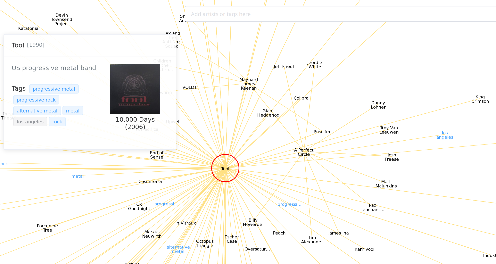

# music-graph-ui

Mobile-friendly frontend UI for music-graph.

Uses Vue.js + ElementUI for the prebuilt components and forms.

This is an interactive D3.js force graph visualisation of music data from various sources. See [https://mg.simon987.net/about](https://mg.simon987.net/about) for more information.

### Api setup

See [music-graph-api](https://github.com/simon987/music-graph-api) for setup instructions.

